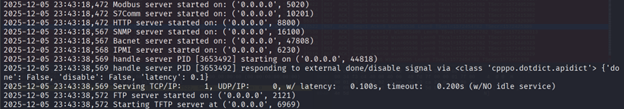
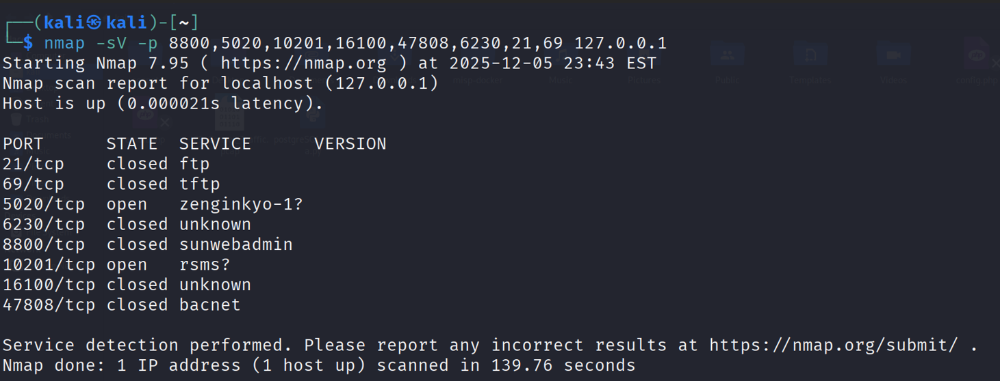
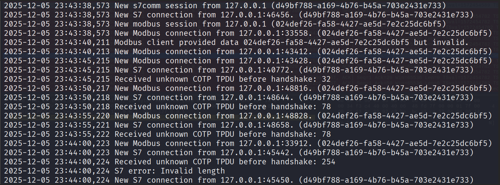
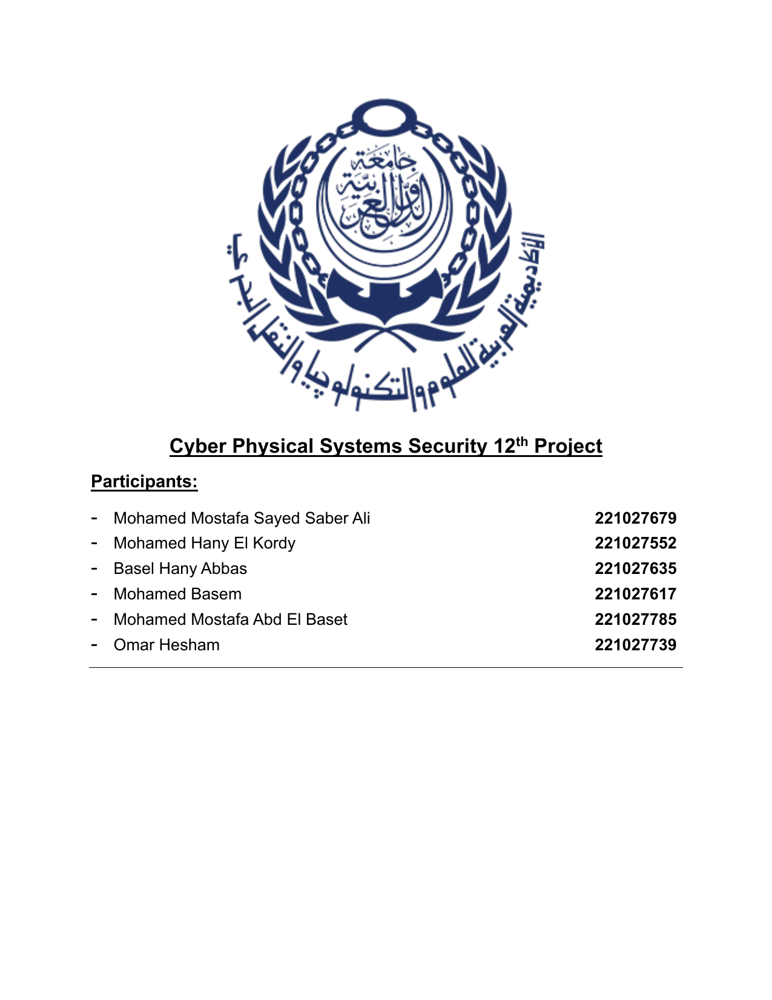

# 🏭 Conpot ICS Honeypot Analysis

This project documents the deployment and analysis of an **Industrial Control Systems (ICS) honeypot** using **Conpot**. It simulates realistic industrial protocols, captures attacker reconnaissance behavior, and provides insights into ICS-targeted threats using tools like **Nmap** and **Wireshark**.

---

## 📋 Project Overview

Industrial Control Systems are critical to infrastructure in energy, water, transportation, and manufacturing. As these systems become more connected, they are increasingly targeted by attackers. This project uses **Conpot**, a lightweight ICS honeypot to safely study attacker behavior without risking real systems.

### Key Objectives:
- Deploy Conpot honeypot in a controlled environment
- Expose common ICS protocols (Modbus, S7Comm, BACnet, SNMP, etc.)
- Capture and analyze network traffic during reconnaissance scans
- Document attacker interaction patterns and tool behaviors

---

## 🛠️ Setup & Configuration

### Installation (Using Virtualenv)
We used a Python virtual environment for better stability and dependency control:

```bash
# Install dependencies
sudo apt-get install git libsmi2ldbl smistrip libxslt1-dev python3.6-dev libevent-dev default-libmysqlclient-dev

# Create virtual environment
virtualenv --python=python3.6 conpot
source conpot/bin/activate

# Upgrade pip and install Conpot
pip install --upgrade pip
pip install --upgrade setuptools
pip install cffi

# Install the table version of Conpot from PyPI
pip install conpot
```

### Running Conpot
```bash
conpot -f --template default
```
This starts Conpot in the foreground using the default template, which simulates a basic industrial controller.

---

## 📡 Exposed Services & Ports

Conpot exposes the following industrial and auxiliary services by default:

| Protocol      | Port     | Description                          |
|---------------|----------|--------------------------------------|
| Modbus/TCP    | 5020     | Industrial automation protocol       |
| S7Comm        | 10201    | Siemens S7 PLC communication         |
| HTTP          | 8800     | Web interface simulation             |
| SNMP          | 16100    | Network management protocol          |
| BACnet        | 47808    | Building automation protocol         |
| IPMI          | 6230     | Remote management protocol           |
| FTP           | 2121     | File transfer protocol               |
| TFTP          | 6969     | Trivial File Transfer Protocol       |

These ports mimic real ICS devices, making the honeypot an attractive target for reconnaissance.

---

## 📊 Analysis & Observations

### Baseline Honeypot Output (Before Any Scanning)
Before running Nmap or any scanner, Conpot logs normal startup messages and internal interactions.

**Typical output observed:**
- Initialization of Modbus, S7comm, HTTP, SNMP, BACnet, IPMI, ENIP, FTP, TFTP
- Creation of virtual filesystem directories
- Detection of external IP address
- No external sessions except internal Conpot checks

**Example excerpt:**
<div align="center">
  
</div>

### Interaction After Running Nmap (Scanner Activity)
After running an Nmap scan, Conpot generated numerous logs showing connection attempts, malformed packets, and protocol negotiation failures, typical when generic scanners probe ICS services they do not fully understand.

**Evidence of Scanning:**
- Repeated new Modbus connections
- Continuous S7Comm connections
- ENIP activity (scanner probing CIP/EthernetIP port)

<div align="center">
  
</div>

**Example Log Entries:**
<div align="center">
  
  
</div>

These entries represent exactly what an attacker's reconnaissance tooling looks like, containing connection IP address and session identifiers.

### Wireshark Traffic Capture
A targeted packet capture was performed using Wireshark with the filter:

```bash
tcp port 5020 or tcp port 10201 or tcp port 8800 or udp port 16100 or udp port 47808 or port 6230 or tcp port 2121 or udp port 6969
```

This allowed us to isolate and analyze only ICS-related activity generated by Conpot and the scanners interacting with it.

**Observed Traffic Includes:**
- **Modbus/TCP (Port 5020):** SYN/SYN-ACK handshakes, Modbus query attempts, reset packets
- **S7Comm (Port 10201):** TPKT headers, COTP protocol initiation, error responses
- **HTTP (Port 8800):** Nmap service detection probes, HTTP GET requests
- **SNMP (Port 16100):** SNMP GET/GET-NEXT requests, simulated replies
- **BACnet (Port 47808):** Device discovery broadcasts, fake BACnet point information
- **IPMI (Port 6230):** Unsolicited probes, template-based IPMI responses
- **FTP (Port 2121):** Anonymous login attempts, simulated FTP banners
- **TFTP (Port 6969):** TFTP Read/Write request attempts

Wireshark PCAP file uploaded in the pcaps/ directory.

---

## 📄 Report Preview

<div align="center">



</div>

## 🧠 Insights & Conclusions

### What Attackers See:
- Multiple open ICS protocol ports
- A simulated web server
- SNMP and management services
- Responses indicating valid protocol headers

### Defensive Value of ICS Honeypots:
- **Early Detection**: Identify scanning bots before they reach real systems
- **Threat Intelligence**: Gather tools, scripts, and methods used by attackers
- **Decoy & Delay**: Waste attacker time and resources
- **Safe Research**: Study malicious activity without risk to real infrastructure

---

## 📁 Repository Structure

```
├── README.md
├── docs/               # Project documentation
├── images/             # Project images
├── pcaps/              # Wireshark Captures
```

---

## 🧪 Future Work
- Extend with custom Conpot templates
- Deploy in a cloud environment for real-world exposure
- Integrate with SIEM for automated alerting
- Analyze attacker behavior over extended periods

---

## 📚 References
- [Conpot Official Documentation](https://conpot.readthedocs.io/)
- [ICS Honeypot Research Papers](https://www.sans.org/white-papers/)
- [Nmap Scripting Engine](https://nmap.org/book/man-nse.html)

---

## 🙌 Acknowledgements
This project was conducted as part of a university cybersecurity research initiative to better understand ICS reconnaissance techniques and improve defensive strategies in critical infrastructure environments.

---

## 📄 License
This project is licensed under the MIT License - see the LICENSE file for details.
